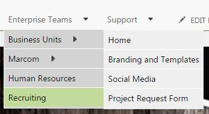
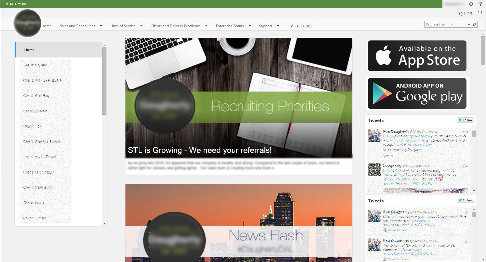

# SharePoint and Angular2

### Before you start
Make sure you have TypeScript 1.8.0+ installed globally. 
As of now that means running:
```
npm install -g typescript@next
```

### What you get from this
A Master page with a fixed navigation menu at the top of the page. This also styles the nav dropdowns so the 3rd level is height matched to the 2nd based on which is tallest.
 


The master page also registers all of the Angular2 scripts and initializes SystemJS to start configuring and loading files.

A Layout Page that loads news items from a list, filters based on selections and shows the items in a modal view. It looks like this (blurred to protect my innocent employer):



All of this uses Bootstrap for responsiveness, because that way you can look to them for style customizations. If you want to customize Bootstrap in some nifty ways check out [Custom Bootstrap Sass](https://github.com/kenhansen01/custom-bootstrap-sass). Customize the files in the custom sass folder before running ` npm install `.

### Pre-requisite steps:
Clone the repository (or download the zip). ` npm install && tsc `. Now the files are ready to be uploaded to SharePoint.

For the navigation to do its thing you will need to have navigation set up with several sub navs.

There needs to be a custom page content type created that is based on Html Page Layout. At the minimum add a single line of text column for the "Site URL" and "List Name". I also added the existing "Page Content". This content type will be applied to whatever page you create from the layout.

The news items are based on 1 list for the news articles and 1 list for the images. I set this up this way because we often use the same image for news about the same topic.

The news articles list has a content type based on Articles. There are 3 additional fields. 
- "Content Channels" is a choice field and you can put as many channels as you like in here, I allow multiple selections. This field populates the selector on the left and filters the news items.
- "News Body" is a multiple lines of text field, that allows full html.
- "News Image" is a publishing image field.

The news images are stored in a Image, Video and Audio assets library.

### Don't upload everything!!!
I mean whatever. If you really want to, go ahead. There's a lot in node_modules that you won't use.

At the site collection masterpage level, put the files in a folder named custom. Other than node_modules, add everything.

Here's what you actually need in node_modules:
```
node_modules
+-- angular2
|||+-- bundles
|||||||-- angular2.dev.js
|||||||-- angular2.js
|||||||-- angular2.min.js
|||||||-- angular2-polyfills.js
|||||||-- angular2-polyfills.min.js
|||||||-- http.dev.js
|||||||-- http.js
|||||||-- http.min.js
|||||||-- router.dev.js
|||||||-- router.js
|||||||-- router.min.js
+-- bootstrap
|||+-- dist
||||||+-- js
||||||||||-- bootstrap.min.js
||||||+-- css
||||||||||-- bootstrap.min.css
+-- es6-shim
||||-- es6-shim.js
||||-- es6-shim.map
||||-- es6-shim.min.js
+-- jquery
|||+-- dist
|||||||-- jquery.js
|||||||-- jquery.min.map
|||||||-- jquery.min.js
+-- reflect-metadata
||||-- Reflect.js
||||-- Reflect.js.map
||||-- Reflect.ts
+-- rxjs
|||+-- bundles
|||||||-- Rx.js
|||||||-- Rx.min.js.map
|||||||-- Rx.min.js
+-- systemjs
|||+-- dist
|||||||-- system.js
|||||||-- system.js.map
|||||||-- system.src.js
|||||||-- system-polyfills.js
|||||||-- system-polyfills.js.map
|||||||-- system-polyfills.src.js
+-- zone.js
|||+-- dist
|||||||-- zone.js
|||||||-- zone.min.js
```
